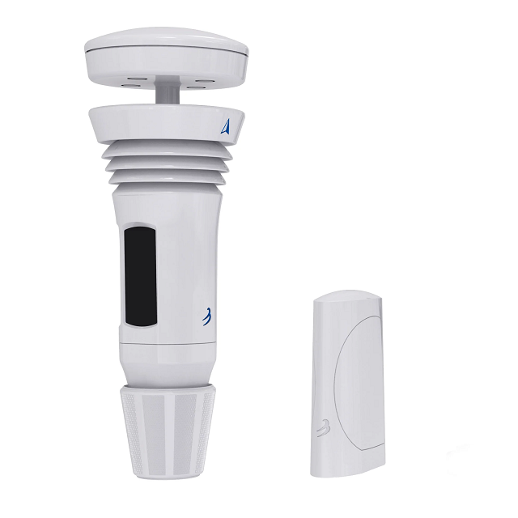
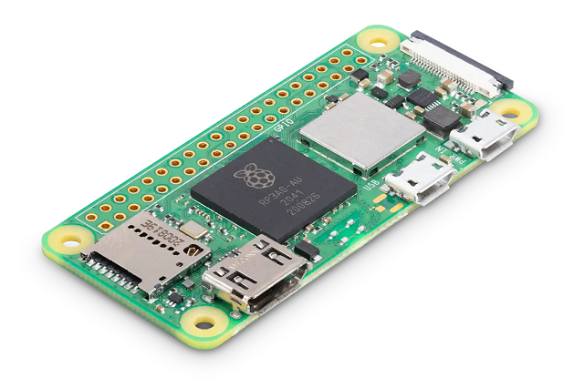
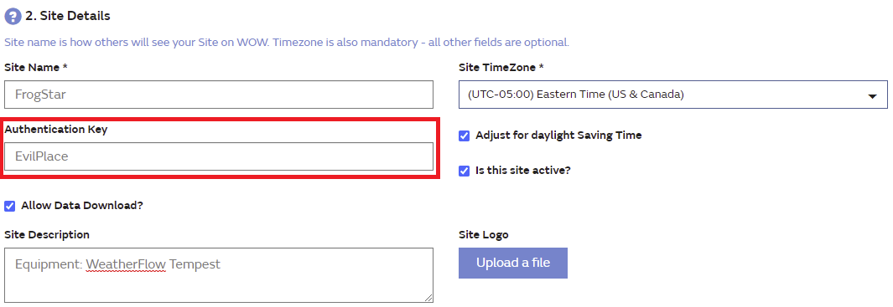
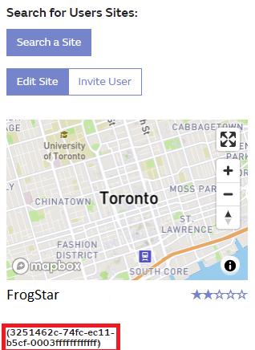

# weewx-tempest-pi

## Contents

[Introduction](#introduction)  
[Hardware Pieces](#hardware-pieces)  
&nbsp;&nbsp;&nbsp;&nbsp;[Full disclosure](#full-disclosure-)  
[Linux, etc.](#linux-etc)  
&nbsp;&nbsp;&nbsp;&nbsp;[Editing](#editing)  
&nbsp;&nbsp;&nbsp;&nbsp;[Introduction](#introduction)  
&nbsp;&nbsp;&nbsp;&nbsp;[Installation](#installation)  
&nbsp;&nbsp;&nbsp;&nbsp;[dietpi](#dietpi)  
[WeeWX](#weewx)  
&nbsp;&nbsp;&nbsp;&nbsp;[Retrieve, Install WeeWX](#retrieve-install-weewx)  
&nbsp;&nbsp;&nbsp;&nbsp;[Installation Notes](#installation-notes)  
&nbsp;&nbsp;&nbsp;&nbsp;[Status](#status)  
[Install WeatherFlow Tempest module](#install-weatherflow-tempest-module)  
&nbsp;&nbsp;&nbsp;&nbsp;[Retrieve weatherflow UDP code](#retrieve-weatherflow-udp-code)  
&nbsp;&nbsp;&nbsp;&nbsp;[Install](#install)  
&nbsp;&nbsp;&nbsp;&nbsp;[[[Station]]](#station)  
&nbsp;&nbsp;&nbsp;&nbsp;[Replace [Simulator] section with [WeatherFlowUDP] content](#replace-simulator-section-with-weatherflowudp-content)  
&nbsp;&nbsp;&nbsp;&nbsp;[[[sensor_map]]](#sensor_map)  
&nbsp;&nbsp;&nbsp;&nbsp;[Get Your Station Identification](#get-your-station-identification)  
[Insert your Serial number into weewx.conf](#insert-your-serial-number-into-weewxconf)  
&nbsp;&nbsp;&nbsp;&nbsp;[View web pages](#view-web-pages)  
&nbsp;&nbsp;&nbsp;&nbsp;[Turn off Station Identification](#turn-off-station-identification)  
[Further Configuration](#further-configuration)  
&nbsp;&nbsp;&nbsp;&nbsp;[Measurement Units](#measurement-units)  
[Seeing Results](#seeing-results)  
&nbsp;&nbsp;&nbsp;&nbsp;[WeatherFlow Tempest Website](#weatherflow-tempest-website)  
&nbsp;&nbsp;&nbsp;&nbsp;[WeeWX Output using FTP](#weewx-output-using-ftp)  
&nbsp;&nbsp;&nbsp;&nbsp;[WeeWX Map](#weewx-map)  
&nbsp;&nbsp;&nbsp;&nbsp;[Weather Underground](#weather-underground)  
&nbsp;&nbsp;&nbsp;&nbsp;[AWEKAS](#awekas)  
&nbsp;&nbsp;&nbsp;&nbsp;[PWS Weather](#pws-weather)  
&nbsp;&nbsp;&nbsp;&nbsp;[Weathercloud](#weathercloud)  
&nbsp;&nbsp;&nbsp;&nbsp;[WOW](#wow)  
[Implementation Notes](#implementation-notes)  
&nbsp;&nbsp;&nbsp;&nbsp;[Transfer from a Raspberry Pi 4 2GB to a Raspberry Pi Zero 2](#transfer-from-a-raspberry-pi-4-2gb-to-a-raspberry-pi-zero-2)  
&nbsp;&nbsp;&nbsp;&nbsp;[Network Connection: Wireless > Ethernet](#network-connection-wireless--ethernet)  

---

## Introduction

This document describes setting up [WeeWX](https://weewx.com/) to process the results from a [**WeatherFlow Tempest**](https://weatherflow.com/tempest-weather-system/) and is derived from:
* <a href="https://weewx.com/docs.html" target="_blank">WeeWX documentation</a>
* <a href="https://github.com/captain-coredump/weatherflow-udp" target="_blank">//github.com/captain-coredump/weatherflow-udp</a>

There is no single cookbook approach to setting up WeeWX with a WeatherFlow Tempest; hence this document. I hope it helps someone.

This document assumes basic knowledge of Linux and a Raspberry Pi if you're using one. If this does not describe you and you want a more detailed approach let me know. I (may, will) add more details in relevant places.

Also, there are introductory notes to show how to publish weather results to:
* [WeatherFlow Tempest Website](#weatherflow-tempest-website)
* [AWEKAS](#awekas)
* [PWS Weather](#pws-weather)
* [Weather Underground](#weather-underground)
* [Weathercloud](#weathercloud)
* [WeeWX](#weewx-output-using-ftp)
* [WOW](#wow)

July 2022

---

## Hardware Pieces
I have the following equipment:

| WeatherFlow Tempest | Raspberry Pi Zero 2 W |
|---|---|
|  |  |


### Full disclosure 😀  
I have had the _WeatherFlow Tempest_ running with WeeWX software on a _Raspberry Pi 4 2 GB_ platform since July 2021. Now, I think that a better $ value is to have _weewx_ running on a _Pi Zero 2_. This document is/was  written as I complete(d) the transfer.

See further comments in [Transfer from a Raspberry Pi 4](#transfer-from-a-raspberry-pi-4-2gb-to-a-raspberry-pi-zero-2).

---

---

## Linux, etc.

### Editing
When editing the configuration and other files, any text editor will do:
* vim
* geany
* thonny
* ....

---

### Introduction

If you're using Ubuntu, Linux Mint, or other Linux, skip this section and jump to [WeeWX](#weewx) below.

### Installation

I am using:<br/>
```
Raspberry Pi OS Lite
Release Date: April 4th, 2022
System: 64-bit
Size: 270MB
```

- Install onto an SD card as usual (I use _rpi_imager_)
- Install SD card into the Pi Zero and start up as usual.
- Configure _ssh_ to run for remote access.

### dietpi
I tried to install _weewx_ with the [**dietpi**](https://dietpi.com/) distro. _weewx_ found all sorts of modules missing and it just wasn't worth the effort to continue. 

---

## WeeWX

### Retrieve, Install WeeWX

From the WeeWx Documentation, follow the topics:
- [Configure apt](https://weewx.com/docs/debian.htm#configure_apt) - shows the specifics of retrieving WeeWX with *apt*.
- [Install](https://weewx.com/docs/debian.htm#Install) WeeWX

#### Installation Notes

The WeeWX installation will ask for the following:

| Value | Note |
| --- | --- |
| **Location of Weather Station** | Enter the name/location of the station. Use the Tempest name, but any name will do (example: Cherry Beach) |
| **latitude, Longitude** | Enter the decimal values of the site co-ordinates.<br/>(Note: installation allows any input here and doesn't check. However, hidden system errors occur at runtime when you supply badly formed values.) |
| **Altitude** | Enter site altitude as directed. |
| **display units** | Make a choice. Further adjustments are easy to make later in the configuration file. |
| **Weather Station hardware Type** | Choose: **Simulator**. |

### Status

On the WeeWX Installation page, follow the topics:

| Value | Note |
| --- | --- |
| **Status** | Log entries will appear. These values are unimportant at this time. |
| **Verify** | Web pages to appear at `/var/www/html/weewx/index.html` |
| **Customize** | Ignore (for now). |
| **Start/Stop** | Stop _weewx_. (`sudo /etc/init.d/weewx stop`) |
| **Uninstall** | Ignore. |
| **Layout** | Keep for reference. |

--- 
## Install WeatherFlow Tempest module

### Retrieve weatherflow UDP code
1. Visit https://github.com/captain-coredump/weatherflow-udp
1. Download the .ZIP download of the project from the GitHub web interface
   1. Button: `CODE`
   1. Choose `Download ZIP`

This retrieves: `weatherflow-udp-master.zip`

### Install
```
sudo wee_extension --install weatherflow-udp-master.zip
```

---

### Edit the configuration file: weewx.config

```
sudo edit /etc/weewx/weewx.conf
```


### [[Station]]
In the `[Station]` section near the top of the configuration file, edit:  
```
    station_type = WeatherFlowUDP
```

### Replace [Simulator] section with [WeatherFlowUDP] content
1. Find the section `[Simulator]`, and delete / comment out all lines in the section, including `[Simulator]`.
1. Copy the following lines to where `[Simulator]` was previously:

```
[WeatherFlowUDP]
    driver = user.weatherflowudp
    log_raw_packets = False
    udp_address = <broadcast>
    # udp_address = 0.0.0.0
    # udp_address = 255.255.255.255
    udp_port = 50222
    udp_timeout = 90
    share_socket = False

    [[sensor_map]]
        outTemp = air_temperature.AR-00004444.obs_air
        outHumidity = relative_humidity.AR-00004444.obs_air
        pressure =  station_pressure.AR-00004444.obs_air
        # lightning_strikes =  lightning_strike_count.AR-00004444.obs_air
        # avg_distance =  lightning_strike_avg_distance.AR-00004444.obs_air
        outTempBatteryStatus =  battery.AR-00004444.obs_air
        windSpeed = wind_speed.SK-00001234.rapid_wind
        windDir = wind_direction.SK-00001234.rapid_wind
        # lux = illuminance.SK-00001234.obs_sky
        UV = uv.SK-00001234.obs_sky
        rain = rain_accumulated.SK-00001234.obs_sky
        windBatteryStatus = battery.SK-00001234.obs_sky
        radiation = solar_radiation.SK-00001234.obs_sky
        # lightningYYY = distance.AR-00004444.evt_strike
        # lightningZZZ = energy.AR-00004444.evt_strike

```
(original source: https://github.com/captain-coredump/weatherflow-udp)

I edited the top part to be:
```
[WeatherFlowUDP]
    driver = user.weatherflowudp
    log_raw_packets = False
    #   log_raw_packets = True
    #   udp_address = <broadcast>
    #   udp_address = 0.0.0.0
    udp_address = 255.255.255.255
    udp_port = 50222
    udp_timeout = 90
    share_socket = False
```

### [[sensor_map]]
Replace the sensor_map section with the following content:  
```
    # This section is for the TEMPEST WeatherFlow Bridge packets, via UDP broadcast on local subnet

    [[sensor_map]]
        outTemp = air_temperature.ST-00000025.obs_st
        outHumidity = relative_humidity.ST-00000025.obs_st
        pressure = station_pressure.ST-00000025.obs_st
        #lightning_strikes =  lightning_strike_count.ST-00000025.obs_st
        #avg_distance =  lightning_strike_avg_distance.ST-00000025.obs_st
        outTempBatteryStatus = battery.ST-00000025.obs_st
        windSpeed = wind_speed.ST-00000025.rapid_wind
        windDir = wind_direction.ST-00000025.rapid_wind
        #luxXXX = illuminance.ST-00000025.obs_st
        UV = uv.ST-00000025.obs_st
        rain = rain_accumulated.ST-00000025.obs_st
        windBatteryStatus = battery.ST-00000025.obs_st
        radiation = solar_radiation.ST-00000025.obs_st
        #lightningXXX = distance.ST-00000025.evt_strike
        #lightningYYY = energy.ST-00000025.evt_strike
```
ref: https://github.com/captain-coredump/weatherflow-udp/blob/master/sample_Tempest_sensor_map.

---

### Get Your Station Identification
The sample code is for data coming from station ID `ST-00000025`. You now need to find out *your* station ID.
  
1. Under `[WeatherFlowUDP]` set:  
```
    log_raw_packets = True
```
2. Save the configuration file (`weewx.conf`).
1. Restart _weewx_.  
  `sudo /etc/init.d/weewx restart`
  
*weewx* will start watching for the UDP packets from the Tempest and dump them in the log. We can see this information with:
  
 `sudo tail -f /var/log/syslog`
  
 You are looking for records like:
  ```
 May 26 22:26:55 raspberrypiZ2-2 weewxd: weatherflowudp: MainThread: raw packet: {'serial_number': 'ST-00052000', 'type': 'rapid_wind', 'hub_sn': 'HB-00041000', 'ob': [1653618412, 0.52, 315]}
May 26 22:28:25 raspberrypiZ2-2 weewxd: weatherflowudp: MainThread: raw packet: {'serial_number': 'ST-00052000', 'type': 'rapid_wind', 'hub_sn': 'HB-00041000', 'ob': [1653618504, 0.29, 312]}
May 26 22:28:26 raspberrypiZ2-2 weewxd: weatherflowudp: MainThread: raw packet: {'serial_number': 'ST-00052000', 'type': 'device_status', 'hub_sn': 'HB-00041000', 'timestamp': 1653618505, 'uptime': 26712917, 'voltage': 2.763, 'firmware_revision': 156, 'rssi': -64, 'hub_rssi': -64, 'sensor_status': 131072, 'debug': 0}
  ```
 (I have slightly obfuscated the serial numbers from my own Weatherflow Tempest).
  
 Terminate the log viewing with Ctl-C.
 
 ---
  
 ## Insert your Serial number into weewx.conf

 1. `sudo edit /etc/weewx/weewx.conf` 
 2. We want the Tempest serial number (here: ST-00052000) in the sensor map code:  
  In /etc/weewx/weewx.conf, search/replace **ST-00000025** with **ST-00052000** (but with what you found in your log file)
 1. I also uncommented all lines in [[sensor_map]]. Not sure what effect this has.
 1. Save the configuration file (`weewx.conf`). 
 1. Restart weewx.  
  `sudo /etc/init.d/weewx restart`
 1. Let run for 10 - 15 minutes (or more).
  
### View web pages
WeeWX has main ouput in web pages at: `/var/www/html/weewx`. To see if WeeWX is working for you, view the web `index.html` file.  
`vim /var/www/html/weewx/index.html`

Browse down and look for output like:
```
  <div class="widget_contents">
  <table>
    <tbody>
      <tr>
        <td class="label">Outside Temperature</td>
        <td class="data">61.7&#176;F</td>
      </tr>
      <tr>
        <td class="label">Heat Index</td>
        <td class="data">61.0&#176;F</td>
      </tr>
      <tr>
        <td class="label">Wind Chill</td>
        <td class="data">61.7&#176;F</td>
      </tr>
      <tr>
        <td class="label">Dew Point</td>
        <td class="data">52.6&#176;F</td>
      </tr>
```
What's notable here is:  
**Outside Temperature** appears with a value of **61.7**. If *weewx* is not configured correctly, you will likely see **N/A**.

### Turn off Station Identification
When you are satisfied that *weewx* is getting the UDP packets from the Tempest hub, you will want to turn off `log_raw_packets` since it will put lots of now unnecessary stuff in the system log. Edit the configuration file (`weewx.conf`).
  
1. `sudo edit /etc/weewx/weewx.conf` 
1. Set `log_raw_packets = False`
1. Save the configuration file.
1. Restart _weewx_.  
  `sudo /etc/init.d/weewx restart`

---

## Further Configuration

### Measurement Units

The default measurement units for *StdReport* appear in `/etc/weewx/weewx.conf` and are set to US units. I set mine to the following (Canadian units):

1. In `/etc/weewx/weewx.conf`, navigate to: **StdReport** >> **Defaults**
1. Set `unit_system = metric`
1. Navigate a few lines down to **Units** >> **Groups**, and edit the respective lines to read:  
```
    group_pressure  = kPa          # Options are 'inHg', 'mmHg', 'mbar', 'hPa', or 'kPa'
    group_rain      = mm           # Options are 'inch', 'cm', or 'mm'
    group_rainrate  = mm_per_hour  # Options are 'inch_per_hour', 'cm_per_hour', or 'mm_per_hour'
```
4. Save the configuration file. 
1. Restart *weewx*.
```
    sudo /etc/init.d/weewx restart
```
---

---
## Seeing Results

### WeatherFlow Tempest Website

On your phone or tablet and in the Tempest configuration app, you specify if you want to share your results publicly.
```
    Settings > Stations > (Station name) > Public Data > Share Publicly
```
A few lines below is the  **Share Page** with the URL of where your weather results appear:
```
    https://tempestwx.com/station/nnnnn
```
...where _`nnnnn`_ is your given station number. It is not the same as the serial numbers of the Tempest of the Hub.

 ---

### WeeWX Output using FTP

I use <a href="https://www.infinityfree.net/" target="_blank">Infinity Free</a> as a web hosting site. It's:
* free
* allows regular ftp upload
* is mostly smooth in producing pages

... and suits my non-professional purposes.

Use the notes in <a href="https://weewx.com/docs/usersguide.htm#config_FTP" target="_blank">FTP</a> in the WeeWX User's Guide for FTP transfer.

For illustration, I have configured:
```
enable = true
user = epiz_redacted
password = redacted
server = ftpupload.net    # The ftp server name, e.g, www.myserver.org
path = /rongrimes.42web.io/htdocs    # The destination directory, e.g., /weather

# Set to True for an FTP over TLS (FTPS) connection. Not all servers
# support this.
secure_ftp = False

# Most FTP servers use port 21
port = 21

# Set to 1 to use passive mode, zero for active mode
passive = 1
```

---

### WeeWX Map

WeeWX maintains a world map of all registered WeeWX stations at:
* <a href="http://weewx.com/stations.html" target="_blank">http://weewx.com/stations.html</a>

To register on the map:
1.  `sudo edit /etc/weewx/weewx.conf`
1. Navigate to: `[StdRESTful] > [[StationRegistry]]`
1. Set `register_this_station = true`
1. Navigate to `station_url` (above in the config file).
1. Set `station_url` to your Weewx website. Really, set it to any website you have control over.
1. Save the configuration file. 
1. Restart *weewx*.
```
    sudo /etc/init.d/weewx restart
```

Check the WeeWX map and your site will appear soon. (I don't remember if it takes 5 minutes, an hour or a day.)

---

### Weather Underground
There are two ways to get your Tempest weather data published to Weather Underground.
1. Direct the Tempest website to publish to Weather Underground. This is the method I use.
1. The *weewx* configuration file can be set up to send data to Weather Underground. See the section in the configuration file: `[[Wunderground]]` 

#### Steps: Weather Underground
1. Navigate to `www.weatherunderground.com`
1. Login to the site. (Use **Join** if you're a new member.)
1. In **My Profile**, go to **My Devices**.
1. Use **Add New Device** and provide data as prompted.
1. From the *Devices* page, record your **ID** and **Key**.

#### Steps: Tempest Website
1. Go to `https://tempestwx.com/` and login with the same username & password that you created for the mobile app.
1. Navigate: **Settings > Stations > (Your station) > Public Data > Weather Underground**
1. Enter your *Station ID* and *Station Key* for Weather Underground from above, and enable the **Send Rain** switch.
1. Click **<** at the top of the page to exit.
1. Check Weather Underground in a day or so to see that it's publishing.

I found that Weather Underground took a while to show my station on the map, but I could find my data explicitly on the Weather Underground web site via **My Profile > My Devices**.

---

### AWEKAS

AWEKAS (Automatisches WEtterKArten System) is an Austrian weather station collecting site with a strong European presence. It is similar in principle to WeatherUndergound in North America.
* <a href="https://www.awekas.at/en/map.php" target="_blank">https://www.awekas.at/en/map.php</a>

To get your weather results displayed with AWEKAS:
1. On the AWEKAS page, navigate to:  
`My Awekas > My Station Panel`
1. Use `Register New`, and supply details as required.
1. Update the WeeWX configuration file with your login information.
1. For illustration, I have:
```
    [[AWEKAS]]
        # This section is for configuring posts to AWEKAS.
        
        # If you wish to do this, set the option 'enable' to true,
        # and specify a username and password.
        # To guard against parsing errors, put the password in quotes.
        enable = true
        username = redacted
        password = redacted
```
5. Save the configuration file. 
1. Restart *weewx*.
```
    sudo /etc/init.d/weewx restart
```

---

### PWS Weather

Weathercloud is a Minnesota (US) station collecting site with fairly repeasentative presence worldwide.
* <a href="https://www.pwsweather.com/map/" target="_blank">https://www.pwsweather.com/map/</a>

To get your weather results displayed with PWS Weather:
1. On the PWS Weather web page, use `Log in`, and create your login ID.
1. Click the button to `Add a station`. If you don't see `Add a station`, log out and log back in again.
1. Provide your station details and then click `SAVED STATION`.
1. Click your station button on the **Stations** web page and retrieve:
   * your `Station ID`
   * your `API Key`.
1. Update the [[PWSweather]] section in the WeeWX configuration file with your station information. (Use your `API Key` for the password).  
1. For illustration, I have:
```
    [[PWSweather]]
        enable = true
        station = EASTTORONTO
        password = 218_redacted
```
7. Save the configuration file. 
1. Restart *weewx*.
```
    sudo /etc/init.d/weewx restart
```

---


### Weathercloud

Weathercloud is a Barcelona station collecting site with a strong European and North American presence.
* <a href="https://app.weathercloud.net/map" target="_blank">https://app.weathercloud.net/map</a>

To get your weather results displayed with Weathercloud:
1. On the Weathercloud page, navigate to:  
`Get started`
1. Use `Sign up`, and supply details as required.
1. You will receive an email with:
    * Weathercloud ID  
    redacted
    * Key  
    redacted
1. Update the WeeWX configuration file with your ID/key information.
1. For illustration, I have:
```
    [[WeatherCloud]]
        id = redacted
        key = redacted
```
5. Save the configuration file. 
1. Visit https://github.com/matthewwall/weewx-wcloud, and follow the directions to install wcloud - the weewx extension that sends data to WeatherCloud.
1. Restart *weewx*.
```
    sudo /etc/init.d/weewx restart
```

---

### WOW
WOW is the UK Met Office WeatherObservationsWebsite with a strong Western Europe, Australia/New Zealand and some North American presence.
* <a href="https://wow.metoffice.gov.uk/" target="_blank">https://wow.metoffice.gov.uk/</a>

I found this site more difficult/less intuitive to set up, and hence a few more notes here regarding configuration. In your WeeWX config file you are asked for two values:
* station
* password

The notes below will help you find these (it's not obvious until you know!).

To get your weather results displayed with WOW:
1. On the WOW page, use `Sign up`, and supply details as required.
1. Use **Create a Site** and supply the information to configure your station entry on WOW.
1. For *Step 1: Configuration* screen in *(2) Site Details*, it will ask for "Authentication Key". Use any value here (but avoid spaces, and "some" special characters), and this will be your WeeWX password value.<br/>Example:  


1. Click **Complete** on the web page to register your site.
1. Review your site (you can find it under **My sites**).
1. The coded value under your station name, is the **station** value for the WeeWX config file.<br/>Example:<br/>


1. In *weewx.conf*, update the [[WOW]] section with your WOW credentials. For illustration, I have:  
```
    [[WOW]]
        # This section is for configuring posts to WOW.
        
        # If you wish to post to WOW, set the option 'enable' to true, then specify a station and
        # password. To guard against parsing errors, put the password in quotes.
        # >> Example values to match images.
        enable = true
        station = "3251462c-74fc-ec11-b5cf-0003ffffffff"
        password = "EvilPlace"
```
5. Save the configuration file. 
1. Restart *weewx*.

```
    sudo /etc/init.d/weewx restart
```

#### WOW Site Data Preferences
The WOW Site registration page uses the **4. Site Data Preferences** section to describe the realistic accuracy of your station. This section was horribly cryptic until I found the section description in the *Support Pages*:  
&nbsp;&nbsp;&nbsp;<a href="https://wow.metoffice.gov.uk/support/siteratings" target="_blank">Support > Site Ratings</a>

#### Debugging the link
I found some help in debugging the upload process in:  
&nbsp;&nbsp;&nbsp;<a href="https://wow.metoffice.gov.uk/support/siteratings" target="_blank">Support > Data Formats and APIs</a>

In particular, I found that using the **Example URL** meant that instead of working with WeeWx to communicate to WOW which could take 5 minutes per cycle, I could instead, manually send REST requests off to WOW at any speed. This way I finally got the *station* (= *siteid*) and *password* (= *Authentication Key* = *siteAuthenticationKey*) correct.

---
---
## Implementation Notes
### Transfer from a Raspberry Pi 4 2GB to a Raspberry Pi Zero 2

As mentioned above, this document was written when I transferred the WeeWX software from a Raspberry Pi 4 2GB to a Raspberry Pi Zero 2.

The essentials of the transfer were particularly easy. I loaded a new WeeWX on the Pi Zero using the directions above and then to transfer the data across:
1. Stop *weewx* on the Raspberry Pi 4, and the Raspberry Zero 2.  
```   sudo /etc/init.d/weewx stop```  
1. Copy `/var/lib/weewx/weewx.sdb` from the Pi 4 to Pi Zero 2.
1. Start *weewv* on the Pi Zero 2. 
The FTP to web server module picked up immediately and transferred web pages on the next 5 minute boundary.

---

### Network Connection: Wireless > Ethernet

I found the wireless connection got faulty after a few days. The symptom being that *weewx* would lose data and frequently show temperature (and other readings) as **N/A** with  the daily graphs being dots instead of continuous lines.

**Cure:** I turned off wireless in the Raspberry Pi Zero 2 and used ethernet-to-usb. The data reception was rock solid from then on.
