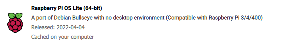

# weewx-pi

#### Development
This note is under development. I am updating as I get the installation correct. 
DO NOT USE yet. 

However, feel free to let me know if you're interested in the progress of this document.

#### Another good source of information

* https://github.com/captain-coredump/weatherflow-udp

May 2022

---

## Introduction

This note describes setting up a **Raspberry Pi** to process the results from a **Weather Flow Tempest**.

I have the following hardware:

| Weatherflow Tempest | Raspberry Pi Zero 2 W |
|---|---|
|  |  |

... with a goal to integrate and broadcast over public weather networks:
* **Weatherflow Tempest Reporting**
* **Weather Underground**
* **AWEKAS**
* **Weather Cloud**
* **weewx Weather reporting**
* **WOW**

### Full disclosure :)  
I have had the _Tempest_ running with _weewx_ software on a _Raspberry Pi 4 2 GB_ platform for 9 months. I think that a better $ value is to have _weewx_ running on a _Pi Zero 2_. 

This document is being written as I convert the station from the _Pi 4_ to _Pi Zero 2_. Since I am converting from an existing system, I may leave a few bits out. If they are annoying, or the document could be improved, please let me know. If otherwise, then, just Sorry!

---

## Raspberry PiOS

I am using: 

### Installation
- Install onto an SD card as usual (I use _rpi_imager_)
- Install SD card into the Pi Zero and start up as usual.
- Configure _ssh_ to run for remote access.

### dietpi
I tried to install _weewx_ with the [**dietpi**](https://dietpi.com/) distro. _weewx_ found all sorts of modules missing and it just wasn't worth the effort to continue. 

---

## weewx

To retrieve and install weewx, follow the guide at [**WeeWX: Installation on Debian-based systems**](https://weewx.com/docs/debian.htm)

### Retrieve, Install weewx

On the Weewx Installation page, follow the topics:
- [Configure apt](https://weewx.com/docs/debian.htm#configure_apt)
- [Install](https://weewx.com/docs/debian.htm#Install)

#### Installation Notes

The _weewx_ installation will ask for the following:

| Value | Note |
| --- | --- |
| **Location of Weather Station** | Enter the name/location of the station. Use the Tempest name, but any name will do (example: Cherry Beach) |
| **latitude, Longitude** | Enter the decimal values of the site co-ordinates. (Note: installation allows any input here and doesn't check. However, hidden system errors occur at runtime with badly formed values.) |
| **Altitude** | Enter site altitude as directed. |
| **display units** | Make a choice. Further adjustments are easy to make later in the configuration file. |
| **Weather Station hardware Type** | Choose: **Simulator**. |

### Status

On the Weewx Installation page, follow the topics:

| Value | Note |
| --- | --- |
| **Status** | Log entries will appear. There values are unimportant at this time. |
| **Verify** | Web pages should appear at `/var/www/html/weewx/index.html` |
| **Customize** | Ignore (for now). |
| **Start/Stop** | Stop _weewx_. (`sudo /etc/init.d/weewx stop`) |
| **Uninstall** | Ignore. |
| **Layout** | Keep for reference. |

--- 
## Install Weather Flow Tempest module

### Retrieve UDP code
- Visit https://github.com/captain-coredump/weatherflow-udp
- Download the .ZIP download of the project from the GitHub web interface
  - Button: `CODE`
  - Choose `Download ZIP`

This retrieves: `weatherflow-udp-master.zip`

### Install
- `sudo wee_extension --install weatherflow-udp-master.zip`
---

## Further Configuration
#### Weather Underground

### Output to web site

---

## Edit template(s)

---

## Additional reporting sites

### AWEKAS

### Weather Cloud, etc
